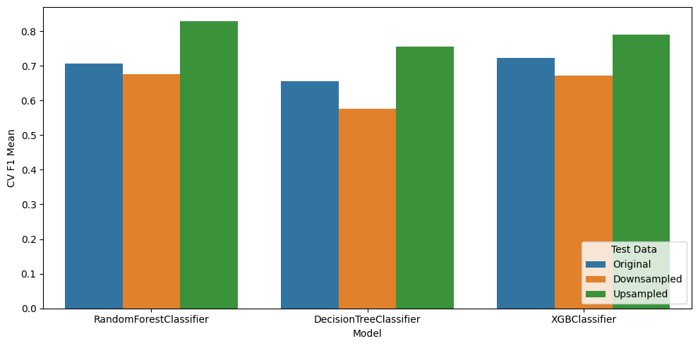

# Predictive-credit-risk-modeling

Credit risk modeling using internal banking data and Transunion CIBIL credit information, the aim of this notebook is to analyze, clean and transform the data and make improvements in the proposed models.

